# TITULO DEL PROYECTO    

**API REST DE PRODUCTOS CON SPRING BOOT REPOSITORIO PARA PODER DESPLEGARLO EN RENDER**

# DESCRIPCIÓN DEL PROYECTO (API REST)
**Creación de una API REST en Java usando Spring Boot, así como como el uso de otras herramientas para su desarrollo, Conexión a base de datos que se explicaran más a detalle A continuación, además se explicara paso a paso con fragmentos de código como se elaboró esta aplicación (API REST), cabe señalar que esta API REST cuenta con el CRUD completo es decir podemos Eliminar, Crear, Actualizar y Leer registros de los productos de la Base De Datos**

## VISTA PREVIA DE NUESTRO PROYECTO YA FUNCIONANDO EN EL SERVIDOR DE RENDER (FORMATO JSON DE LA API DE LOS PRODUCTOS QUE REGISTRAMOS):
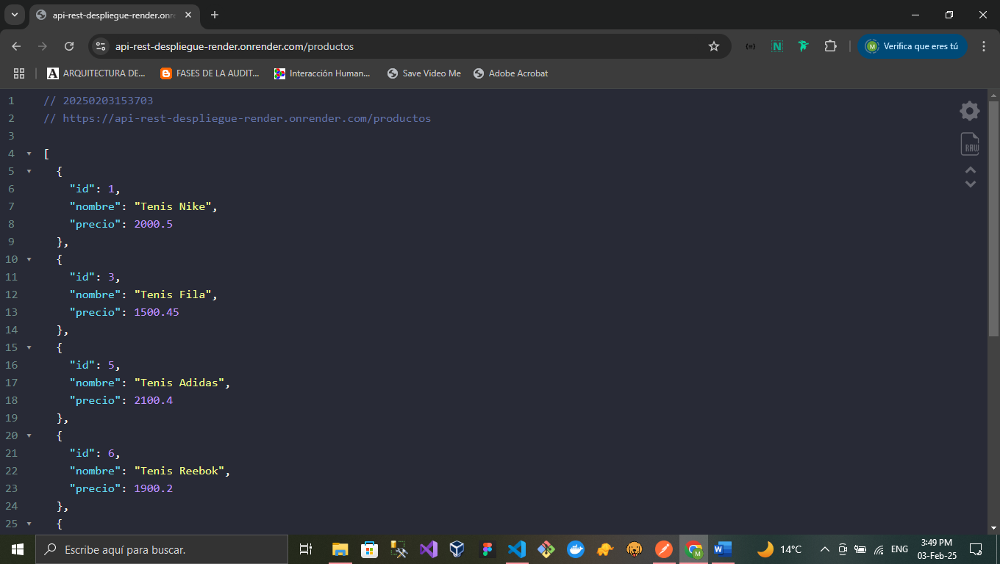
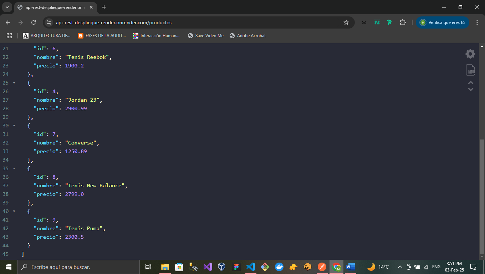

## DESARROLLO DE LA API (ARQUITECTURA DE SOFTWARE API REST USANDO EL FRAMEWORK SPRING BOOT)
**Para el desarrollo de nuestra API aplicamos lo que es un tipo de arquitectura que maneja Java basado en Framework Spring Boot el cual se compone de las siguientes partes:**
1. Controllers 
2. Entities
3. Repositories

## PARTE1 DE LA API (Entities)
**Para comenzar a desarrollar nuestro proyecto comenzamos con la parte de las entidades que van a representar los objetos y van a encapsular los datos  y comportamientos de esos objetos y finalmente van hacer mapeados con base de datos en este proyecto usamos una API de productos el cual nuestra entidad en la base datos a hacer PRODUCTO el cual es representado como un archivo de clase propio de Java(Producto.java) dentro de nuestra carpeta Entities de nuestro repositorio en conclusión este archivo contendrá los campos que contiene nuestra tabla en la base de datos como lo es ID,NOMBRE,PRECIO, además usamos un decoradores propios de Spring @Entity,@ @Id y @GeneratedValue para saber que es una clase de tipo entidad y además que el ID sea autoincremental. Por último, tenemos lo que son los getters y setters del id,nombre y precio a continuación el código de nuestra clase de entidad Producto:**
```Java
    package com.mario.apirest.apirest.Entities;
    import jakarta.persistence.Entity;
    import jakarta.persistence.GeneratedValue;
    import jakarta.persistence.GenerationType;
    import jakarta.persistence.Id;

    @Entity
    public class Producto {

        @Id
        @GeneratedValue(strategy = GenerationType.IDENTITY)
        private Long id;
        private String nombre;
        private double precio;
        public Long getId() {
            return id;
        }
        public void setId(Long id) {
            this.id = id;
        }
        public String getNombre() {
            return nombre;
        }
        public void setNombre(String nombre) {
            this.nombre = nombre;
        }
        public double getPrecio() {
            return precio;
        }
        public void setPrecio(double precio) {
            this.precio = precio;
        }
    }
```
## PARTE2 DE LA API (Repository)
**En la segunda parte de nuestro proyecto haremos lo que es el Repositorio, que prácticamente son componentes que interactúan con la capa de persistencia es decir que va permitir la lectura, la escritura y eliminación de una base de datos este archivo es de tipo Interfaz en Java que lo llamamos en nuestro proyecto ProductoRepository.java dentro de nuestra carpeta Repositories, Esta interfaz extiende de algo que se le conoce como JpaRepository el cual es propio de Spring para la capa de persistencia el cual recibe dos datos la Entidad de la base de datos que en este caso es Producto y el tipo de dato que tiene el ID de la tabla de la base datos que este caso es Long y es todo lo que contiene nuestro archivo a continuación el código de lo explicado anteriormente:**
```Java
    package com.mario.apirest.apirest.Repositories;
    import org.springframework.data.jpa.repository.JpaRepository;
    import com.mario.apirest.apirest.Entities.Producto;
    public interface ProductoRepository extends JpaRepository<Producto, Long>{

    }
```
## PARTE3 DE LA API (Controllers)  
**En esta parte del desarrollo de la API vamos a explicar lo del Controlador que va hacer un archivo de clase de Java el cual llamamos ProductoController que está en nuestra carpeta Controllers, el controlador nos va ha permitir hacer las rutas para poder interactuar con vista y la lógica de negocios de la API REST por medio de los métodos Http para poder Crear, leer, actualizar y eliminar registros de la base de datos de nuestra Api. Nuestro archivo de nuestro proyecto contiene varios decoradores propios de Spring que nos ayudaran a hacer el CRUD en nuestra API REST TALES COMO:@RestController:para poder hacer la estructura del Backend,@RequestMapping:contine la ruta donde se hará todo que ente caso es /productos,@Autowired: con este lo hacemos es hacer una inyección de una instancia en el repositorio,@GetMapping: este nos traira toda la información de todos los productos que tiene la API, además usamos una colección de tipo List en Java para listar los productos,@PostMapping:Con este vamos a crear un producto en la API vamos a pasarle un body y para eso usaremos el decorador de Spring @RequestBody,@PutMapping con este decorador vamos actualizar el producto que queramos a través de su ID para poder leer el ID que tiene el producto vamos a usar el decorador @PathVariable y con este podemos pasar el ID en la ruta y finalmente con el decorador @DeleteMapping vamos a poder eliminar el producto de nuestra base de datos. A continuación, dejamos el código del uso de los decoradores antes mencionados utilizados en nuestro proyecto:**
```Java
    package com.mario.apirest.apirest.Controllers;
    import java.util.List;
    import org.springframework.beans.factory.annotation.Autowired;
    import org.springframework.web.bind.annotation.DeleteMapping;
    import org.springframework.web.bind.annotation.GetMapping;
    import org.springframework.web.bind.annotation.PathVariable;
    import org.springframework.web.bind.annotation.PostMapping;
    import org.springframework.web.bind.annotation.PutMapping;
    import org.springframework.web.bind.annotation.RequestBody;
    import org.springframework.web.bind.annotation.RequestMapping;
    import org.springframework.web.bind.annotation.RestController;
    import com.mario.apirest.apirest.Repositories.ProductoRepository;
    import com.mario.apirest.apirest.Entities.Producto;

    @RestController
    @RequestMapping("/productos")
    public class ProductoController {
        // hacer una inyección de una instancia en el repositorio
        @Autowired
        private ProductoRepository productoRepository;

        // Método Get Http
        @GetMapping
        public List<Producto> getAllProductos(){
            return productoRepository.findAll();
        }

        // Método Get individual por Id Http
        @GetMapping("/{id}")
        public Producto getProductById(@PathVariable Long id){
            return productoRepository.findById(id)
            .orElseThrow(() -> new RuntimeException("No se encontró el producto con el ID: " + id));
        }

        // Método Post Http
        @PostMapping
        public Producto createProducto(@RequestBody Producto producto){
            return productoRepository.save(producto);
        }
        // Método Put Http
        @PutMapping("/{id}")
        public Producto updateProducto(@PathVariable Long id, @RequestBody Producto productoDetails){
            Producto producto = productoRepository.findById(id)
                .orElseThrow(() -> new RuntimeException("No se encontró el producto con el ID: " + id));
            producto.setNombre(productoDetails.getNombre());
            producto.setPrecio(productoDetails.getPrecio());
            return productoRepository.save(producto);
        } 
        // Método  Delete Http
        @DeleteMapping("/{id}")
        public String deleteProduct(@PathVariable Long id){
            Producto producto = productoRepository.findById(id)
                .orElseThrow(() -> new RuntimeException("No se encontró el producto con el ID: " + id));
            productoRepository.delete(producto);
            return " El producto con el ID: " + id + " fue eliminado correctamente";    
        }
    }
```
## MANEJO DE ERRORES Y EXEPCIONES EN NUESTRO PROYECTO
**Para hacer el manejo de errores esto lo aplicamos en el controlador de la API en el archivo explicado anteriormente para esto usamos los metodos propios de Java que son el .orElseThrow y acompañado del RuntimeException como se pude apreciar en el código anterior**

## MANEJO DE LOS METODOS JPA DE SPRING BOOT
**Para poder hacer alteraciones a la base de datos utilizamos en nuestro proyecto algunos de los metodos ya predeterminados de SPRING BOOT los cuales son los siguientes:**
1. Save()->Guarda el registro en la base de datos
2. delete()->Elimina el registro de la base datos
3. findAll()->Traemos todos los registros de la base de datos
4. findById()->Buscamos un registro en la base datos por su ID

## CONFIGURACION DEL ARCHIVO APPLICATION.PROPERTIES(Para poder desplegarlo en Render)
**Ahora como siguiente paso vamos a configurar este archivo el cual nos va a permitir hacer el despliegue de nuestra aplicación en Render para eso vamos primero a dejar que Render automáticamente escoja el puerto donde va a correr nuestra aplicación es decir quitamos la línea donde habíamos puesto que correría en el puerto 8080, Ahora para poder hacer el despliegue de Docker ya que en la versión 21 de Java aun no la soporta Render por eso usaremos una configuración especial usando Docker en este archivo y además Render sepa que usare como base de datos PostgreSQL usando Hibernate. Por otro lado, también necesitamos que Render pueda saber cuales son las variables de entorno de nuestra aplicación eso también fue configurado en este archivo quedando nuestro archivo de la siguiente manera:**
```Spring
    spring.jpa.properties.hibernate.dialect=org.hibernate.dialect.PostgreSQLDialect
    spring.jpa.hibernate.ddl-auto=update
    spring.jpa.hibernate.show-sql=true
    spring.application.name=apirest
    spring.config.import=optional:file:.env[.properties]
    spring.datasource.url=${SPRING_DATASOURCE_URL}
    spring.datasource.username=${SPRING_DATASOURCE_USERNAME}
    spring.datasource.password=${SPRING_DATASOURCE_PASSWORD}
```

## BAJAMOS LA VERSION DE NUESTGRO SPRING EN EL ARCHIVO pom.xml(3.2.1)
```
    <version>3.2.1</version>
```
## Creación de un archivo Docker para generar una imagen(Dockerfile)
**En esta parte vamos a generar un archivo Docker para poder generar una imagen Docker dentro del ambiente de Render es decir una imagen de Java 21 ya que Render no es compatible con esta version de Java**
```Docker
    FROM eclipse-temurin:21-jdk as build

    COPY . /app
    WORKDIR /app

    RUN chmod +x mvnw
    RUN ./mvnw package -DskipTests
    RUN mv -f target/*.jar app.jar

    FROM eclipse-temurin:21-jre
    ARG PORT
    ENV PORT=${PORT}

    COPY --from=build /app/app.jar .

    RUN useradd runtime
    USER runtime

    ENTRYPOINT [ "java", "-Dserver.port=${PORT}", "-jar", "app.jar" ]
```
## CREACION DE VARIBLES DE ENTORNO PARA LA BASE DE DATOS
**Lo siguiente es poder comunicar este archivo con las variables de entorno que vamos a crear estas son la URL,USERNAME de la base de datos, el PASSWORD de la base de datos y el nombre de la base datos. Cabe mencionar que en la URL vamos a definir el tipo de base de datos ente proyecto se manejó PostgreSQL, estas variables son confidenciales y no se suben a un repositorio a continuación solo mostrare como queda su estructura:**
```env
    SPRING_DATASOURCE_URL=jdbc:postgresql://localhost:5432/database
    SPRING_DATASOURCE_USERNAME=
    SPRING_DATASOURCE_PASSWORD=
    SPRING_DATASOURCE_DB=
```
## VARIABLES DE ENTORNO QUE CREAMOS EN NUESTRO API PARA PODER INSERTARLAS EN RENDER
```
    SPRING_DATASOURCE_URL=jdbc:postgresql://dpg-cubtgot2ng1s73asgrag-a.virginia-postgres.render.com:5432/mario_postgresql
    SPRING_DATASOURCE_USERNAME=mario_postgresql_user
    SPRING_DATASOURCE_PASSWORD=cqju6P90zkFGypt4RX0S84n5gdlvarWk
    SPRING_DATASOURCE_DB=mario_postgresql
```
**En esta parte configuramos las variables de entorno con su información, después de haber creado la base de datos PostgreSQL en Render donde nos genera una URL del servidor donde esta nuestra base de datos, así como la contraseña de nuestra base de datos, etc. Ahora nuestras variables de entorno configuradas en nuestro Servidor de Render.**

## CREACION DE BASE DE DATOS POSTGRESQL EN RENDER Y CONFIGURACION DE VARIABLES DE ENTORNO EN RENDER
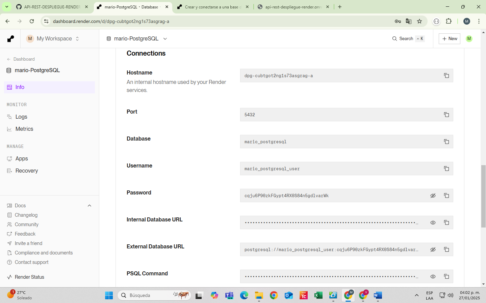
## ENV
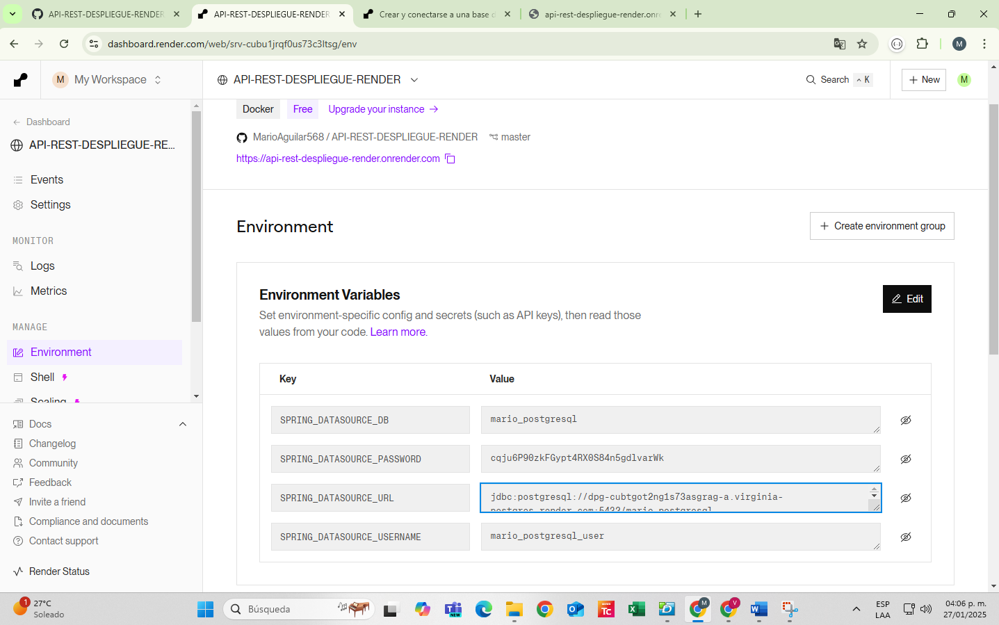

## IMPORTACION DE LAS VARIABLES DE ENTORNO AL ARCHIVO APPLICATION.PROPERTIES
**En esta parte vamos a importar y hacer uso de las variables de entorno en nuestro archivo properties para eso lo hacemos de la siguiente manera en SPRING BOOT:**
```spring
    spring.config.import=optional:file:.env[.properties]
    spring.datasource.url=${SPRING_DATASOURCE_URL}
    spring.datasource.username=${SPRING_DATASOURCE_USERNAME}
    spring.datasource.password=${SPRING_DATASOURCE_PASSWORD}
```
## DEPLOY DE NUESTRA API EN RENDER USANDO DOCKER(imgen Java 21)
**Para desplegar nuestro proyecto en render lo hicimos a través de un repositorio de Git que contiene todos los archivos de nuestra API, después de configurar las variables de entorno y hacer el archivo Dockerfile de Java así como sus configuraciones necesarias  ahora si lo desplegamos a producción como se muestra a continuación:**
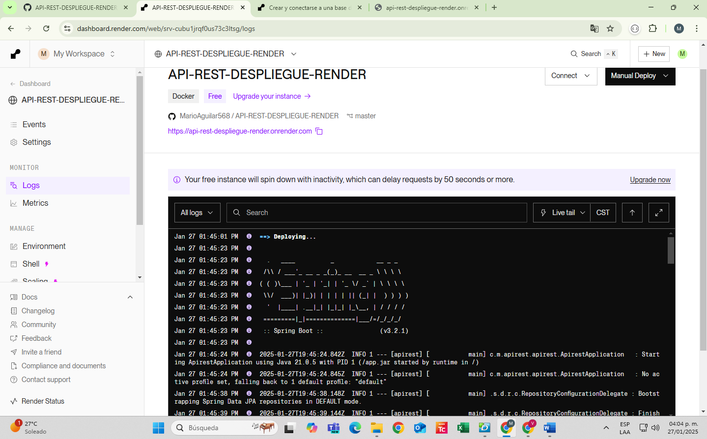
## DESPLEGANDO API
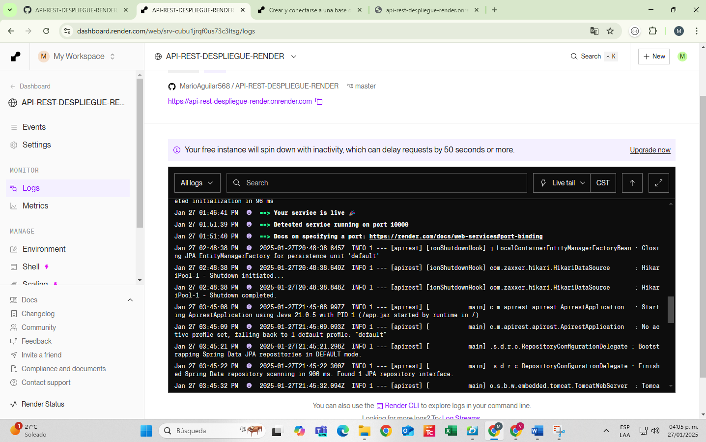
## MOSTRANDO CONEXION LA BASE DE DATOS POSTGRESQL MEDIANTE TABLEPLUS AL SERVIDOR MONTADO EN RENDER
**Aquí nos conectamos a la base datos con nuestro nombre de usuario, contraseña, nombre de la base de datos , puerto y el Host ya no de manera local si no en el servidor de Render ya desplegado:**
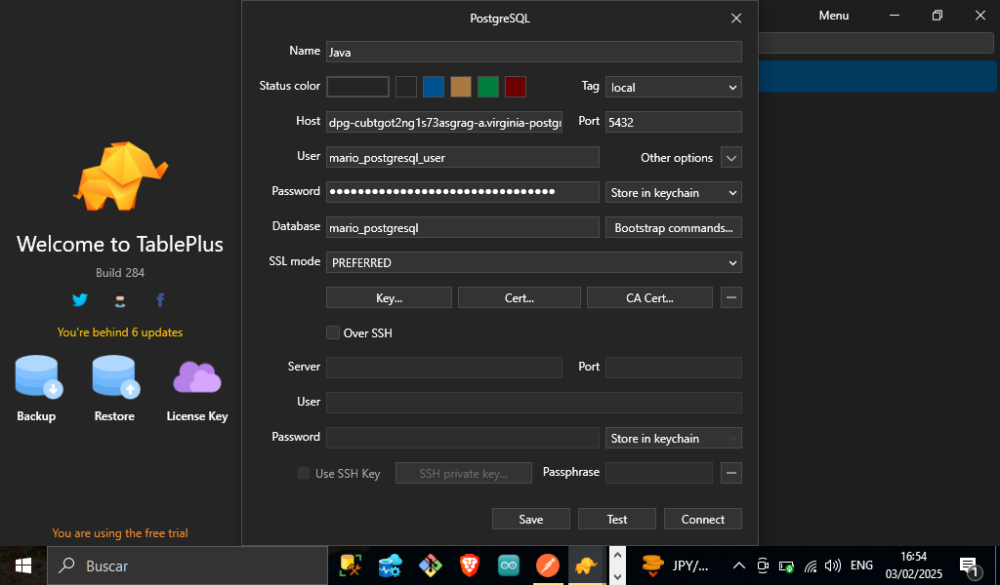

## REGISTROS DE LA BASE DE DATOS POSTGRESQL QUE SE ENCUENTRAN EN EL SERVIDOR DE RENDER(TABLA PRODUCTOS)
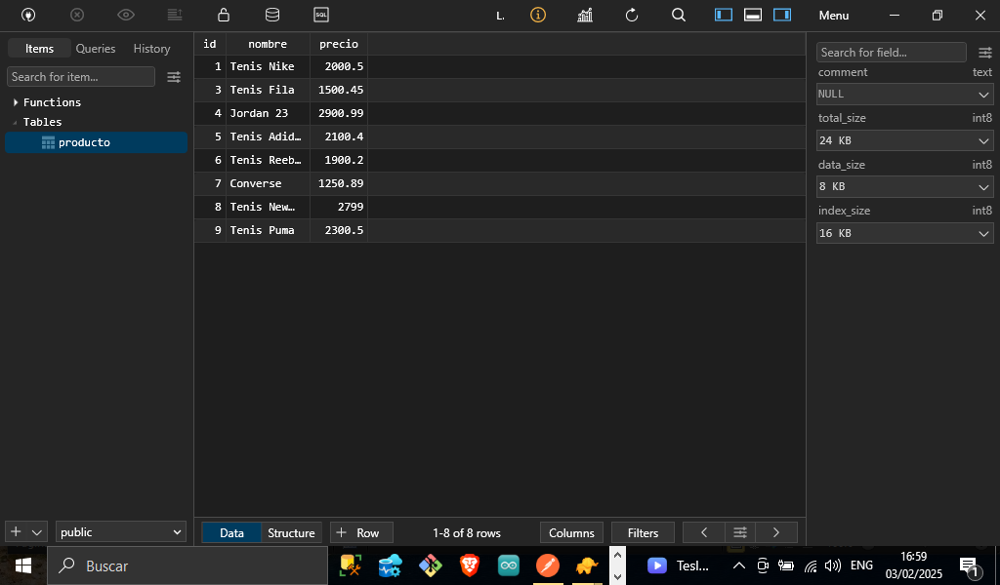 

## METODOS HTTP Y CODIGOS DE RESPUSTA USADOS EN LA API REST
| METODO | CODIGO |
:-----: | :-----:
POST | 201 - 200
GET | 200
GET ID | 200
PUT | 201
DELETE | 200 - 202 - 204

## CONSUMIENDO NUESTRA API REST CON POSTMAN YA CON UNA DIRECCION DE URL DE RENDER [Api-rest-spring-boot-java](https://api-rest-despliegue-render.onrender.com/productos)

**Postman es un cliente para poder consumir APIs a continuación muestro como se consumió nuestra aplicación con todos los metodos que anteriormente mencionamos**
POSTMAN REST | POSTMAN REST
:-----: | :-----:
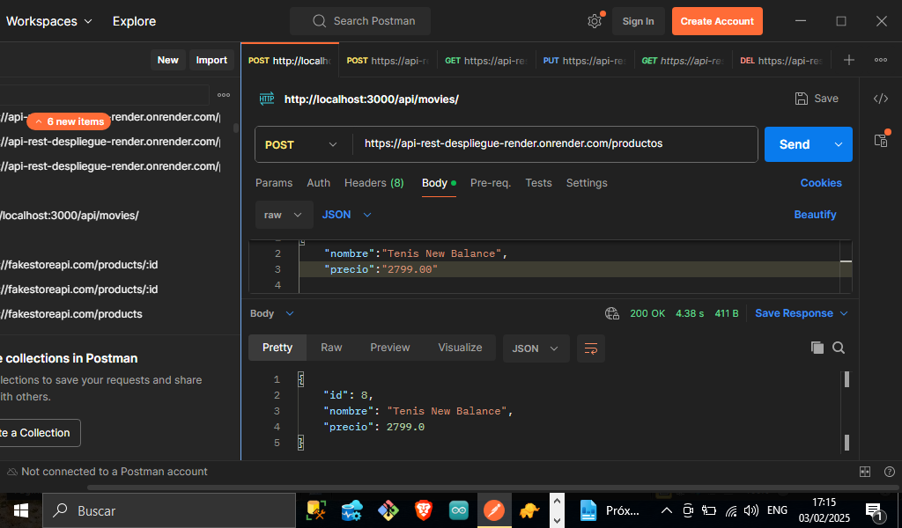 |  |
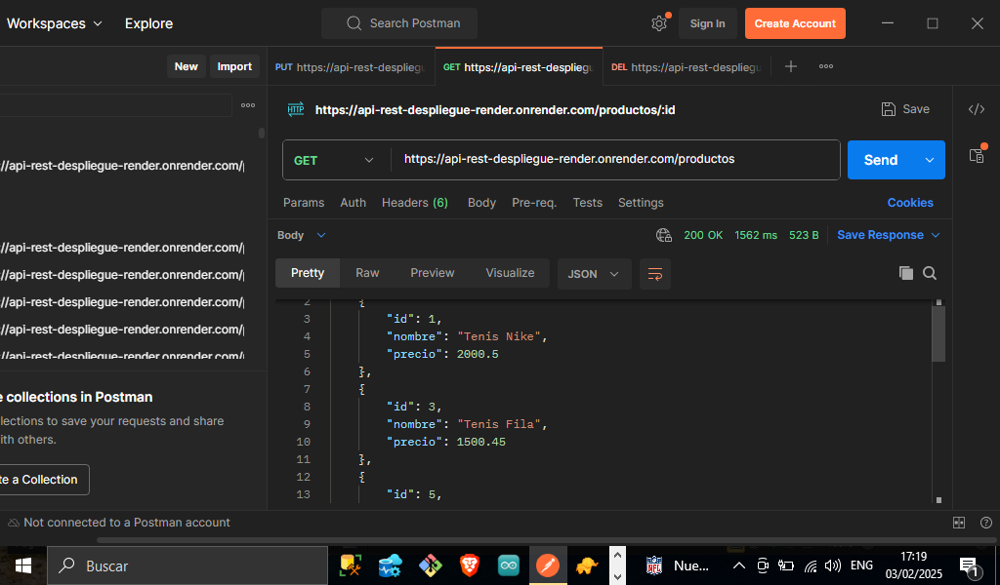 | 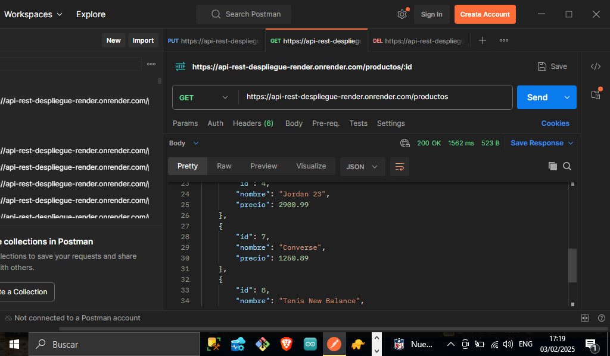 |
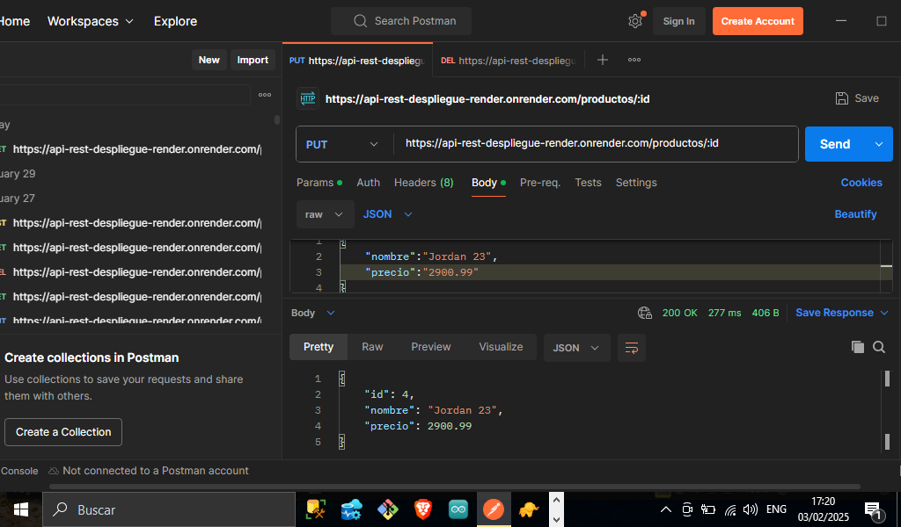 | 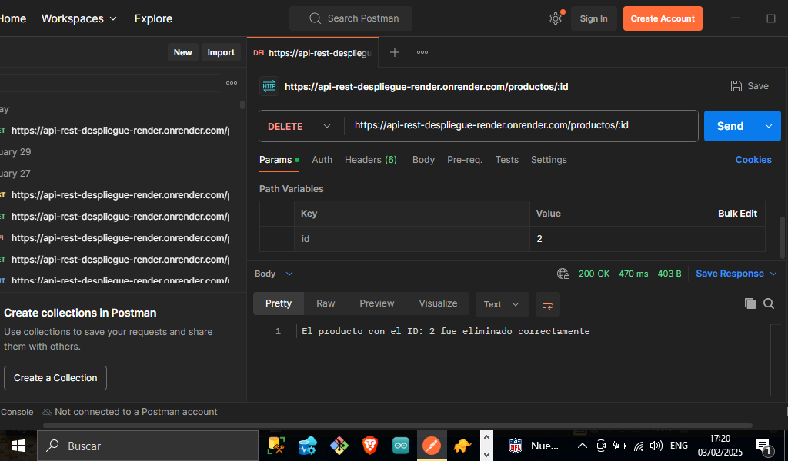 |


 ### Lista De Tecnologías, Propiedades De Java, Spring Boot , Hibernate,Docker,Maven Y Herramientas Usadas En Nuestro Proyecto(API REST)  

1. Java(Lenguaje De Programación)
2. Spring Boot(Framework Para El Desarrollo De La API) 
3. Hibernate(Framework Para El Mapeo Vinculo De Los Atributos De La BDD)
4. PostgreSQL(Base De Datos)
5. Maven(Estructura, Gestión Y Construcción Del Proyecto Java)
6. Docker(Manejo De Imágenes Y Contenedores)
7. Spring Boot(Manejo De Decoradores) 
8. Jpa De Spring(Manejo De Metodos Para Alterar La BDD) 
9.  Creación De Base De Datos(Postgresql en Render)
10. TablePlus(Conexión A La Base De Datos)
11. Postman(Para Consumir Nuestra API) 
12. Entities(Entidad De La Base De Datos)
13. Controllers(Controlador En Spring)
14. Repository(Repository En Spring)
15. Jdk(Para El Manejo De Java)
16. GitHub
17. Manejo De Variables De Entorno(.env)
18. Configuración(Archivo application.properties)
19. Manejo De Errores(.orElseThrow,RuntimeException)
20. Render(Para poder desplegar nuestra aplicación)
21. Uso De Docker En Render(Imagen Java Spring-boot)

# *Elaborado Por: Mario Martínez Aguilar*


